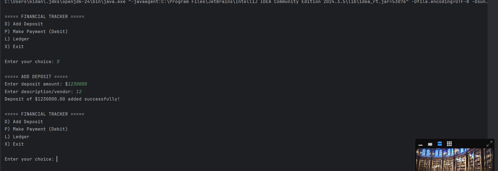

#Accounting Ledger Application Analysis
*Interesting Code Aspects
The most fascinating aspect of this Java application is how it implements a complete accounting system with a clean architecture and data handling: 

1. Immutable Transaction Class Design
The Transaction class is designed as an immutable record-style class:
static final class Transaction {
    private final LocalDate date;
    private final LocalTime time;
    private final String description;
    private final String vendor;
    private final double amount;
 
This immutability provides thread safety and prevents accidental modifications to transaction data after creation.

2. Custom Serialization/Deserialization
The application implements its own CSV parsing logic rather than using a library:
public static Transaction fromCSV(String line) {
    String[] parts = line.split("\\|");
    if (parts.length != 5) {
        throw new IllegalArgumentException("Invalid CSV line format: " + line);

In here it uses pipe (|) delimiters instead of commas, which is a good practice to handle transaction descriptions or vendor names that might contain commas.

3. Modern Java Time API Usage
The application uses the modern Java Time API (java.time package) instead of the older java.util.Date:
import java.time.LocalDate;
import java.time.LocalDateTime;
import java.time.LocalTime;

This provides more intuitive date/time handling with methods like:
LocalDate firstDayOfPreviousMonth = today.minusMonths(1).withDayOfMonth(1);

#Overall Architecture
The application follows a clean, object-oriented design with a focus on:

Separation of concerns: Clear distinctions between data representation, user interaction, and file operations
Menu-driven interface: Hierarchical menu system for intuitive navigation
Data persistence: Automatic saving and loading of transaction data
Report generation: Various filtering mechanisms for analyzing transaction history

#Key Features

*Transaction Management:

Add deposits (credits)
Make payments (debits)
Store transaction details (date, time, description, vendor, amount)

*Financial Reporting:

All transactions view
Deposits-only view
Payments-only view
Time-based reports (month-to-date, previous month, year-to-date, previous year)
Vendor-specific searches

*File Operations:

Load transactions from CSV file
Save transactions to CSV file
Handles file I/O exceptions gracefully

*User Experience:

Clear menu structure
Input validation
Sensible defaults
Formatted transaction display

#The application would be useful for individuals or small business owners who want to maintain detailed financial records without needing complex accounting software, all through a straightforward command-line interface.

    
   

